# The Complete GitHub Markdown Reference

> Every single GitHub Flavored Markdown (GFM) feature in one file. Copy and paste freely.

---

## Table of Contents

- [Headings](#headings)
- [Text Formatting](#text-formatting)
- [Blockquotes](#blockquotes)
- [Lists](#lists)
- [Task Lists / Checkboxes](#task-lists--checkboxes)
- [Links](#links)
- [Images](#images)
- [Code](#code)
- [Tables](#tables)
- [Horizontal Rules](#horizontal-rules)
- [Line Breaks & Paragraphs](#line-breaks--paragraphs)
- [Escaping Characters](#escaping-characters)
- [HTML in Markdown](#html-in-markdown)
- [Emoji](#emoji)
- [Footnotes](#footnotes)
- [Alerts / Admonitions](#alerts--admonitions)
- [Details / Collapsible Sections](#details--collapsible-sections)
- [Definition Lists (via HTML)](#definition-lists-via-html)
- [Mathematical Expressions (LaTeX)](#mathematical-expressions-latex)
- [Mermaid Diagrams](#mermaid-diagrams)
- [GeoJSON / TopoJSON Maps](#geojson--topojson-maps)
- [STL 3D Models](#stl-3d-models)
- [References & Autolinks](#references--autolinks)
- [Mentions & Team Mentions](#mentions--team-mentions)
- [SHA, Issue & PR References](#sha-issue--pr-references)
- [Keyboard Keys](#keyboard-keys)
- [Superscript & Subscript](#superscript--subscript)
- [Highlighting / Marking Text](#highlighting--marking-text)
- [Anchor Links](#anchor-links)
- [Relative Links & Repository Links](#relative-links--repository-links)
- [Badges & Shields](#badges--shields)
- [Table of Contents (Auto-generated)](#table-of-contents-auto-generated)
- [Comments (Hidden Text)](#comments-hidden-text)
- [Videos](#videos)
- [Color Chips / Color Preview](#color-chips--color-preview)
- [Diff / Colored Diff Blocks](#diff--colored-diff-blocks)
- [YAML Front Matter](#yaml-front-matter)
- [Drag-and-Drop Attachments](#drag-and-drop-attachments)
- [GitHub-Specific Syntax Summary](#github-specific-syntax-summary)

---

## Headings

```markdown
# Heading 1
## Heading 2
### Heading 3
#### Heading 4
##### Heading 5
###### Heading 6
```

# Heading 1
## Heading 2
### Heading 3
#### Heading 4
##### Heading 5
###### Heading 6

### Alternative heading syntax

```markdown
Heading 1
=========

Heading 2
---------
```

Heading 1
=========

Heading 2
---------

### Heading with custom ID (not natively supported, but works via HTML)

```html
<h3 id="my-custom-id">Heading with Custom ID</h3>
```

<h3 id="my-custom-id">Heading with Custom ID</h3>

---

## Text Formatting

```markdown
**Bold text**
__Also bold text__

*Italic text*
_Also italic text_

***Bold and italic***
___Also bold and italic___
**_Another bold and italic_**
*__Yet another bold and italic__*

~~Strikethrough text~~

<u>Underlined text</u>

<ins>Inserted text (underlined)</ins>

<del>Deleted text (strikethrough via HTML)</del>

<s>Another strikethrough via HTML</s>

<mark>Highlighted / marked text</mark>

Superscript: X<sup>2</sup>
Subscript: H<sub>2</sub>O

<small>Small text</small>

<big>Big text (deprecated but sometimes works)</big>

<samp>Sample output text</samp>

<var>Variable text</var>

<cite>Citation text</cite>

<q>Short inline quotation</q>

<abbr title="Hyper Text Markup Language">HTML</abbr> — hover for full text

<bdo dir="rtl">This text will be written right to left</bdo>
```

**Bold text**
__Also bold text__

*Italic text*
_Also italic text_

***Bold and italic***
___Also bold and italic___
**_Another bold and italic_**
*__Yet another bold and italic__*

~~Strikethrough text~~

<u>Underlined text</u>

<ins>Inserted text (underlined)</ins>

<del>Deleted text (strikethrough via HTML)</del>

<s>Another strikethrough via HTML</s>

<mark>Highlighted / marked text</mark>

Superscript: X<sup>2</sup>
Subscript: H<sub>2</sub>O

<small>Small text</small>

<big>Big text (deprecated but sometimes works)</big>

<samp>Sample output text</samp>

<var>Variable text</var>

<cite>Citation text</cite>

<q>Short inline quotation</q>

<abbr title="Hyper Text Markup Language">HTML</abbr> — hover for full text

<bdo dir="rtl">This text will be written right to left</bdo>

---

## Blockquotes

```markdown
> Single-level blockquote

> Multi-line blockquote
> that spans several lines
> and keeps going.

> Nested blockquotes
>> Second level
>>> Third level
>>>> Fourth level

> **Bold text inside a blockquote**
>
> - List inside a blockquote
> - Another item
>
> ```
> Code block inside a blockquote
> ```
```

> Single-level blockquote

> Multi-line blockquote
> that spans several lines
> and keeps going.

> Nested blockquotes
>> Second level
>>> Third level
>>>> Fourth level

> **Bold text inside a blockquote**
>
> - List inside a blockquote
> - Another item
>
> ```
> Code block inside a blockquote
> ```

---

## Lists

### Unordered lists

```markdown
- Item 1
- Item 2
  - Nested item 2a
  - Nested item 2b
    - Deep nested item
- Item 3

* Asterisk item 1
* Asterisk item 2

+ Plus item 1
+ Plus item 2
```

- Item 1
- Item 2
  - Nested item 2a
  - Nested item 2b
    - Deep nested item
- Item 3

* Asterisk item 1
* Asterisk item 2

+ Plus item 1
+ Plus item 2

### Ordered lists

```markdown
1. First item
2. Second item
3. Third item
   1. Sub-item 3a
   2. Sub-item 3b
4. Fourth item

1. All items can use 1.
1. Markdown auto-increments
1. The rendered numbers
```

1. First item
2. Second item
3. Third item
   1. Sub-item 3a
   2. Sub-item 3b
4. Fourth item

1. All items can use 1.
1. Markdown auto-increments
1. The rendered numbers

### Starting ordered lists at a specific number

```markdown
57. This list starts at 57
58. Next item
59. And so on
```

57. This list starts at 57
58. Next item
59. And so on

### Mixed lists

```markdown
1. Ordered item
   - Unordered sub-item
   - Another unordered sub-item
     1. Back to ordered
     2. Still ordered
2. Next ordered item
```

1. Ordered item
   - Unordered sub-item
   - Another unordered sub-item
     1. Back to ordered
     2. Still ordered
2. Next ordered item

### Lists with paragraphs / multi-line content

```markdown
1. First item

   Paragraph within the first item. Indent with spaces to keep it under the list item.

2. Second item

   Another paragraph here.

   > Even a blockquote inside a list item.

3. Third item

   ```python
   # Code block inside a list item
   print("Hello from inside a list!")
   ```
```

1. First item

   Paragraph within the first item. Indent with spaces to keep it under the list item.

2. Second item

   Another paragraph here.

   > Even a blockquote inside a list item.

3. Third item

   ```python
   # Code block inside a list item
   print("Hello from inside a list!")
   ```

---

## Task Lists / Checkboxes

```markdown
- [x] Completed task
- [x] Another completed task
- [ ] Incomplete task
- [ ] Another incomplete task
  - [x] Nested completed task
  - [ ] Nested incomplete task
```

- [x] Completed task
- [x] Another completed task
- [ ] Incomplete task
- [ ] Another incomplete task
  - [x] Nested completed task
  - [ ] Nested incomplete task

Task lists inside ordered lists:

```markdown
1. [x] First task done
2. [ ] Second task pending
3. [ ] Third task pending
```

1. [x] First task done
2. [ ] Second task pending
3. [ ] Third task pending

---

## Links

### Inline links

```markdown
[GitHub](https://github.com)
[GitHub with title](https://github.com "GitHub Homepage")
```

[GitHub](https://github.com)
[GitHub with title](https://github.com "GitHub Homepage")

### Autolinks

```markdown
https://github.com
http://example.com
fake@example.com
```

https://github.com
http://example.com
fake@example.com

### Reference-style links

```markdown
[I'm a reference link][reference id]
[Or use the link text itself]

[reference id]: https://github.com
[Or use the link text itself]: https://github.com/about
```

[I'm a reference link][reference id]
[Or use the link text itself]

[reference id]: https://github.com
[Or use the link text itself]: https://github.com/about

### Relative links

```markdown
[Link to a file in the repo](docs/guide.md)
[Link to a header](#headings)
[Link to a file in parent directory](../other-repo/file.md)
```

### Section / anchor links

```markdown
[Jump to Text Formatting](#text-formatting)
[Jump to Tables](#tables)
```

[Jump to Text Formatting](#text-formatting)
[Jump to Tables](#tables)

### Links with formatting

```markdown
[**Bold link**](https://github.com)
[*Italic link*](https://github.com)
[`Code link`](https://github.com)
[~~Strikethrough link~~](https://github.com)
```

[**Bold link**](https://github.com)
[*Italic link*](https://github.com)
[`Code link`](https://github.com)
[~~Strikethrough link~~](https://github.com)

### Disabling autolinks

```markdown
`https://this-wont-be-a-link.com`
```

`https://this-wont-be-a-link.com`

---

## Images

### Inline images

```markdown


```


### Reference-style images

```markdown
![Alt text][logo]

[logo]: https://github.githubassets.com/images/modules/logos_page/GitHub-Mark.png "GitHub Logo"
```

![Alt text][logo]

[logo]: https://github.githubassets.com/images/modules/logos_page/GitHub-Mark.png "GitHub Logo"

### Images with links (clickable images)

```markdown
[](https://github.com)
```

[](https://github.com)

### Image sizing via HTML

```html


```


### Centered image via HTML

```html
<p align="center">
  
</p>
```

<p align="center">
  
</p>

### Image in a collapsible section

```html
<details>
<summary>Click to reveal image</summary>


</details>
```

<details>
<summary>Click to reveal image</summary>


</details>

### Theme-aware images (light/dark mode)

```markdown


```

Or using HTML `<picture>`:

```html
<picture>
  <source media="(prefers-color-scheme: dark)" srcset="https://via.placeholder.com/200/000000/ffffff?text=Dark">
  <source media="(prefers-color-scheme: light)" srcset="https://via.placeholder.com/200/ffffff/000000?text=Light">
  
</picture>
```

<picture>
  <source media="(prefers-color-scheme: dark)" srcset="https://via.placeholder.com/200/000000/ffffff?text=Dark">
  <source media="(prefers-color-scheme: light)" srcset="https://via.placeholder.com/200/ffffff/000000?text=Light">
  
</picture>

---

## Code

### Inline code

```markdown
Use `git status` to check your working tree.
Use ``literal `backtick` inside inline code`` with double backticks.
```

Use `git status` to check your working tree.
Use ``literal `backtick` inside inline code`` with double backticks.

### Fenced code blocks

````markdown
```
Plain code block with no language
```

```javascript
// JavaScript
function greet(name) {
  console.log(`Hello, ${name}!`);
}
```

```python
# Python
def greet(name):
    print(f"Hello, {name}!")
```

```bash
# Bash
echo "Hello, World!"
for i in {1..5}; do
  echo "Number: $i"
done
```

```ruby
# Ruby
def greet(name)
  puts "Hello, #{name}!"
end
```

```java
// Java
public class Main {
    public static void main(String[] args) {
        System.out.println("Hello, World!");
    }
}
```

```go
// Go
package main

import "fmt"

func main() {
    fmt.Println("Hello, World!")
}
```

```rust
// Rust
fn main() {
    println!("Hello, World!");
}
```

```typescript
// TypeScript
const greet = (name: string): void => {
  console.log(`Hello, ${name}!`);
};
```

```c
// C
#include <stdio.h>
int main() {
    printf("Hello, World!\n");
    return 0;
}
```

```cpp
// C++
#include <iostream>
int main() {
    std::cout << "Hello, World!" << std::endl;
    return 0;
}
```

```csharp
// C#
using System;
class Program {
    static void Main() {
        Console.WriteLine("Hello, World!");
    }
}
```

```swift
// Swift
print("Hello, World!")
```

```kotlin
// Kotlin
fun main() {
    println("Hello, World!")
}
```

```php
// PHP
<?php
echo "Hello, World!";
?>
```

```sql
-- SQL
SELECT * FROM users WHERE active = 1 ORDER BY name;
```

```html
<!-- HTML -->
<div class="container">
  <h1>Hello, World!</h1>
</div>
```

```css
/* CSS */
.container {
  display: flex;
  justify-content: center;
  align-items: center;
}
```

```scss
// SCSS
$primary-color: #333;
.container {
  color: $primary-color;
  .header {
    font-size: 2rem;
  }
}
```

```json
{
  "name": "example",
  "version": "1.0.0",
  "dependencies": {}
}
```

```yaml
# YAML
name: CI Pipeline
on: [push, pull_request]
jobs:
  build:
    runs-on: ubuntu-latest
    steps:
      - uses: actions/checkout@v4
```

```toml
# TOML
[package]
name = "my-app"
version = "0.1.0"
edition = "2021"
```

```xml
<!-- XML -->
<configuration>
  <setting name="debug" value="true" />
</configuration>
```

```ini
; INI
[section]
key = value
another_key = another_value
```

```markdown
<!-- Markdown inside a code block -->
# This is markdown
**Bold** and *italic*
```

```dockerfile
# Dockerfile
FROM node:18-alpine
WORKDIR /app
COPY package*.json ./
RUN npm install
COPY . .
EXPOSE 3000
CMD ["node", "server.js"]
```

```makefile
# Makefile
.PHONY: build
build:
	go build -o bin/app ./cmd/app

test:
	go test ./...
```

```shell
# Shell session
$ git clone https://github.com/user/repo.git
Cloning into 'repo'...
$ cd repo
$ ls
README.md  src/  tests/
```

```r
# R
library(ggplot2)
ggplot(data = mtcars, aes(x = wt, y = mpg)) +
  geom_point()
```

```lua
-- Lua
function greet(name)
  print("Hello, " .. name .. "!")
end
```

```haskell
-- Haskell
main :: IO ()
main = putStrLn "Hello, World!"
```

```elixir
# Elixir
defmodule Greeter do
  def hello(name), do: IO.puts("Hello, #{name}!")
end
```

```terraform
# Terraform / HCL
resource "aws_instance" "example" {
  ami           = "ami-0c55b159cbfafe1f0"
  instance_type = "t2.micro"
}
```

```graphql
# GraphQL
query {
  user(id: "1") {
    name
    email
    posts {
      title
    }
  }
}
```

```powershell
# PowerShell
Get-Process | Where-Object { $_.CPU -gt 100 } | Sort-Object CPU -Descending
```

```plaintext
This is plaintext — no syntax highlighting.
Just raw text as-is.
```
````

### Indented code blocks (4 spaces)

```markdown
    function hello() {
      console.log("Indented code block");
    }
```

    function hello() {
      console.log("Indented code block");
    }

---

## Tables

### Basic table

```markdown
| Header 1 | Header 2 | Header 3 |
| -------- | -------- | -------- |
| Row 1    | Data     | Data     |
| Row 2    | Data     | Data     |
| Row 3    | Data     | Data     |
```

| Header 1 | Header 2 | Header 3 |
| -------- | -------- | -------- |
| Row 1    | Data     | Data     |
| Row 2    | Data     | Data     |
| Row 3    | Data     | Data     |

### Alignment

```markdown
| Left-aligned | Center-aligned | Right-aligned |
| :----------- | :------------: | ------------: |
| Left         |    Center      |         Right |
| Text         |     Text       |          Text |
| More         |     More       |          More |
```

| Left-aligned | Center-aligned | Right-aligned |
| :----------- | :------------: | ------------: |
| Left         |    Center      |         Right |
| Text         |     Text       |          Text |
| More         |     More       |          More |

### Tables with formatting

```markdown
| Feature        | Syntax                    | Rendered                 |
| -------------- | ------------------------- | ------------------------ |
| Bold           | `**bold**`                | **bold**                 |
| Italic         | `*italic*`                | *italic*                 |
| Strikethrough  | `~~strike~~`              | ~~strike~~               |
| Code           | `` `code` ``              | `code`                   |
| Link           | `[text](url)`             | [text](https://github.com) |
| Emoji          | `:+1:`                    | :+1:                     |
```

| Feature        | Syntax                    | Rendered                 |
| -------------- | ------------------------- | ------------------------ |
| Bold           | `**bold**`                | **bold**                 |
| Italic         | `*italic*`                | *italic*                 |
| Strikethrough  | `~~strike~~`              | ~~strike~~               |
| Code           | `` `code` ``              | `code`                   |
| Link           | `[text](url)`             | [text](https://github.com) |
| Emoji          | `:+1:`                    | :+1:                     |

### Wide table with many columns

```markdown
| Col 1 | Col 2 | Col 3 | Col 4 | Col 5 | Col 6 | Col 7 | Col 8 |
| ----- | ----- | ----- | ----- | ----- | ----- | ----- | ----- |
| a     | b     | c     | d     | e     | f     | g     | h     |
```

| Col 1 | Col 2 | Col 3 | Col 4 | Col 5 | Col 6 | Col 7 | Col 8 |
| ----- | ----- | ----- | ----- | ----- | ----- | ----- | ----- |
| a     | b     | c     | d     | e     | f     | g     | h     |

### Minimal table syntax (pipes on edges are optional)

```markdown
Header 1 | Header 2
--- | ---
Data | Data
```

Header 1 | Header 2
--- | ---
Data | Data

---

## Horizontal Rules

```markdown
---
***
___
- - -
* * *
```

---

***

___

---

## Line Breaks & Paragraphs

```markdown
This is the first line.  
This is the second line (two trailing spaces above create a line break).

This is a new paragraph (blank line above).

This line uses an HTML break.<br>This continues on a new line.

This line uses an HTML break.<br/>Also valid with self-closing tag.
```

This is the first line.  
This is the second line (two trailing spaces above create a line break).

This is a new paragraph (blank line above).

This line uses an HTML break.<br>This continues on a new line.

This line uses an HTML break.<br/>Also valid with self-closing tag.

---

## Escaping Characters

```markdown
\* Not italic \*
\# Not a heading
\- Not a list item
\> Not a blockquote
\[ Not a link \]
\` Not inline code \`
\| Not a table pipe \|
\\ Literal backslash
\_ Not italic \_
\~ Not strikethrough \~
\{ \} \( \) Literal braces and parens
\. Not an ordered list trigger
\! Not an image trigger
```

\* Not italic \*
\# Not a heading
\- Not a list item
\> Not a blockquote
\[ Not a link \]
\` Not inline code \`
\| Not a table pipe \|
\\ Literal backslash
\_ Not italic \_
\~ Not strikethrough \~
\{ \} \( \) Literal braces and parens
\. Not an ordered list trigger
\! Not an image trigger

---

## HTML in Markdown

GitHub allows a subset of HTML tags in Markdown. Here are the commonly supported ones:

### Text formatting HTML

```html
<b>Bold</b>
<i>Italic</i>
<em>Emphasis</em>
<strong>Strong</strong>
<u>Underline</u>
<s>Strikethrough</s>
<del>Deleted</del>
<ins>Inserted</ins>
<mark>Highlighted</mark>
<sup>Superscript</sup>
<sub>Subscript</sub>
<small>Small text</small>
<code>Inline code</code>
<pre>Preformatted text</pre>
<kbd>Keyboard input</kbd>
<samp>Sample output</samp>
<var>Variable</var>
```

<b>Bold</b>
<i>Italic</i>
<em>Emphasis</em>
<strong>Strong</strong>
<u>Underline</u>
<s>Strikethrough</s>
<del>Deleted</del>
<ins>Inserted</ins>
<mark>Highlighted</mark>
<sup>Superscript</sup>
<sub>Subscript</sub>
<small>Small text</small>
<code>Inline code</code>
<pre>Preformatted text</pre>
<kbd>Keyboard input</kbd>
<samp>Sample output</samp>
<var>Variable</var>

### Structural HTML

```html
<div align="center">
  <h3>Centered Heading</h3>
  <p>Centered paragraph</p>
</div>

<p align="right">Right-aligned text</p>

<br>

<hr>

<blockquote>HTML blockquote</blockquote>
```

<div align="center">
  <h3>Centered Heading</h3>
  <p>Centered paragraph</p>
</div>

<p align="right">Right-aligned text</p>

<br>

<hr>

<blockquote>HTML blockquote</blockquote>

### HTML tables (for more control than Markdown tables)

```html
<table>
  <thead>
    <tr>
      <th>Feature</th>
      <th>Status</th>
      <th>Notes</th>
    </tr>
  </thead>
  <tbody>
    <tr>
      <td>Auth</td>
      <td>:white_check_mark:</td>
      <td>Fully implemented</td>
    </tr>
    <tr>
      <td colspan="2"><strong>Merged cell</strong></td>
      <td>Uses colspan</td>
    </tr>
    <tr>
      <td rowspan="2">Spans 2 rows</td>
      <td>Row A</td>
      <td>Data A</td>
    </tr>
    <tr>
      <td>Row B</td>
      <td>Data B</td>
    </tr>
  </tbody>
</table>
```

<table>
  <thead>
    <tr>
      <th>Feature</th>
      <th>Status</th>
      <th>Notes</th>
    </tr>
  </thead>
  <tbody>
    <tr>
      <td>Auth</td>
      <td>:white_check_mark:</td>
      <td>Fully implemented</td>
    </tr>
    <tr>
      <td colspan="2"><strong>Merged cell</strong></td>
      <td>Uses colspan</td>
    </tr>
    <tr>
      <td rowspan="2">Spans 2 rows</td>
      <td>Row A</td>
      <td>Data A</td>
    </tr>
    <tr>
      <td>Row B</td>
      <td>Data B</td>
    </tr>
  </tbody>
</table>

---

## Emoji

### Emoji shortcodes

```markdown
:smile: :laughing: :blush: :smiley: :heart_eyes:
:sunglasses: :thumbsup: :thumbsdown: :clap: :pray:
:fire: :100: :sparkles: :star: :star2:
:rocket: :zap: :boom: :collision: :rainbow:
:white_check_mark: :heavy_check_mark: :ballot_box_with_check:
:x: :negative_squared_cross_mark: :no_entry_sign:
:warning: :exclamation: :question: :interrobang:
:heart: :yellow_heart: :green_heart: :blue_heart: :purple_heart:
:tada: :confetti_ball: :balloon: :gift: :trophy:
:bug: :wrench: :hammer: :nut_and_bolt: :gear:
:memo: :pencil: :pencil2: :clipboard: :books:
:bulb: :flashlight: :mag: :mag_right:
:lock: :unlock: :key: :shield:
:bell: :no_bell: :mute: :speaker: :sound:
:email: :mailbox: :inbox_tray: :outbox_tray:
:arrow_up: :arrow_down: :arrow_left: :arrow_right:
:arrows_clockwise: :arrows_counterclockwise:
:rewind: :fast_forward: :arrow_forward: :arrow_backward:
:heavy_plus_sign: :heavy_minus_sign: :heavy_multiplication_x: :heavy_division_sign:
:recycle: :wastebasket: :package: :link: :paperclip:
:octocat: :shipit:
```

:smile: :laughing: :blush: :smiley: :heart_eyes:
:sunglasses: :thumbsup: :thumbsdown: :clap: :pray:
:fire: :100: :sparkles: :star: :star2:
:rocket: :zap: :boom: :collision: :rainbow:
:white_check_mark: :heavy_check_mark: :ballot_box_with_check:
:x: :negative_squared_cross_mark: :no_entry_sign:
:warning: :exclamation: :question: :interrobang:
:heart: :yellow_heart: :green_heart: :blue_heart: :purple_heart:
:tada: :confetti_ball: :balloon: :gift: :trophy:
:bug: :wrench: :hammer: :nut_and_bolt: :gear:
:memo: :pencil: :pencil2: :clipboard: :books:
:bulb: :flashlight: :mag: :mag_right:
:lock: :unlock: :key: :shield:
:bell: :no_bell: :mute: :speaker: :sound:
:email: :mailbox: :inbox_tray: :outbox_tray:
:arrow_up: :arrow_down: :arrow_left: :arrow_right:
:arrows_clockwise: :arrows_counterclockwise:
:rewind: :fast_forward: :arrow_forward: :arrow_backward:
:heavy_plus_sign: :heavy_minus_sign: :heavy_multiplication_x: :heavy_division_sign:
:recycle: :wastebasket: :package: :link: :paperclip:
:octocat: :shipit:

### Unicode emoji (direct paste)

You can also paste Unicode emoji directly: `🎉 🚀 ✅ ❌ ⚠️ 💡 🔥 🐛 📝 🔧`

---

## Footnotes

```markdown
Here is a sentence with a footnote.[^1]

Here is another sentence with a named footnote.[^note]

[^1]: This is the first footnote.
[^note]: This is the named footnote.
    
    Footnotes can span multiple paragraphs if you indent them.
```

Here is a sentence with a footnote.[^1]

Here is another sentence with a named footnote.[^note]

[^1]: This is the first footnote.
[^note]: This is the named footnote.
    
    Footnotes can span multiple paragraphs if you indent them.

---

## Alerts / Admonitions

GitHub supports five types of alerts (also called callouts):

```markdown
> [!NOTE]
> Useful information that users should know, even when skimming content.

> [!TIP]
> Helpful advice for doing things better or more easily.

> [!IMPORTANT]
> Key information users need to know to achieve their goal.

> [!WARNING]
> Urgent info that needs immediate user attention to avoid problems.

> [!CAUTION]
> Advises about risks or negative outcomes of certain actions.
```

> [!NOTE]
> Useful information that users should know, even when skimming content.

> [!TIP]
> Helpful advice for doing things better or more easily.

> [!IMPORTANT]
> Key information users need to know to achieve their goal.

> [!WARNING]
> Urgent info that needs immediate user attention to avoid problems.

> [!CAUTION]
> Advises about risks or negative outcomes of certain actions.

### Alerts with rich content

```markdown
> [!NOTE]
> You can use **bold**, *italic*, `code`, and [links](https://github.com) inside alerts.
>
> - Lists work too
> - Another item
>
> ```python
> print("Code blocks inside alerts!")
> ```
```

> [!NOTE]
> You can use **bold**, *italic*, `code`, and [links](https://github.com) inside alerts.
>
> - Lists work too
> - Another item
>
> ```python
> print("Code blocks inside alerts!")
> ```

---

## Details / Collapsible Sections

```html
<details>
<summary>Click to expand</summary>

This content is hidden by default.

You can put **any Markdown** in here:
- Lists
- **Bold text**
- `Code`

</details>

<details open>
<summary>This section is open by default</summary>

Use the `open` attribute to have it expanded initially.

</details>
```

<details>
<summary>Click to expand</summary>

This content is hidden by default.

You can put **any Markdown** in here:
- Lists
- **Bold text**
- `Code`

</details>

<details open>
<summary>This section is open by default</summary>

Use the `open` attribute to have it expanded initially.

</details>

### Nested collapsible sections

```html
<details>
<summary>Outer section</summary>

Some outer content.

<details>
<summary>Inner section</summary>

Some inner content.

</details>

</details>
```

<details>
<summary>Outer section</summary>

Some outer content.

<details>
<summary>Inner section</summary>

Some inner content.

</details>

</details>

### Collapsible code blocks

<details>
<summary>Click to see full configuration file</summary>

```json
{
  "compilerOptions": {
    "target": "ES2020",
    "module": "commonjs",
    "lib": ["ES2020"],
    "strict": true,
    "esModuleInterop": true,
    "skipLibCheck": true,
    "forceConsistentCasingInFileNames": true,
    "outDir": "./dist",
    "rootDir": "./src",
    "declaration": true,
    "declarationMap": true,
    "sourceMap": true
  },
  "include": ["src/**/*"],
  "exclude": ["node_modules", "dist"]
}
```

</details>

---

## Definition Lists (via HTML)

Markdown doesn't natively support definition lists, but HTML works:

```html
<dl>
  <dt>Term 1</dt>
  <dd>Definition of term 1</dd>

  <dt>Term 2</dt>
  <dd>Definition of term 2</dd>
  <dd>A second definition for term 2</dd>

  <dt><strong>Bold Term</strong></dt>
  <dd>You can use formatting in terms and definitions too</dd>
</dl>
```

<dl>
  <dt>Term 1</dt>
  <dd>Definition of term 1</dd>

  <dt>Term 2</dt>
  <dd>Definition of term 2</dd>
  <dd>A second definition for term 2</dd>

  <dt><strong>Bold Term</strong></dt>
  <dd>You can use formatting in terms and definitions too</dd>
</dl>

---

## Mathematical Expressions (LaTeX)

GitHub supports LaTeX math via MathJax.

### Inline math

```markdown
The quadratic formula is $x = \frac{-b \pm \sqrt{b^2 - 4ac}}{2a}$ inline.

Einstein's equation: $E = mc^2$

The Pythagorean theorem: $a^2 + b^2 = c^2$
```

The quadratic formula is $x = \frac{-b \pm \sqrt{b^2 - 4ac}}{2a}$ inline.

Einstein's equation: $E = mc^2$

The Pythagorean theorem: $a^2 + b^2 = c^2$

### Block math (display mode)

```markdown
$$
\int_{-\infty}^{\infty} e^{-x^2} dx = \sqrt{\pi}
$$

$$
\sum_{n=1}^{\infty} \frac{1}{n^2} = \frac{\pi^2}{6}
$$

$$
\begin{aligned}
\nabla \times \vec{E} &= -\frac{\partial \vec{B}}{\partial t} \\
\nabla \times \vec{B} &= \mu_0 \vec{J} + \mu_0 \varepsilon_0 \frac{\partial \vec{E}}{\partial t}
\end{aligned}
$$

$$
\begin{pmatrix}
a & b \\
c & d
\end{pmatrix}
\begin{pmatrix}
x \\
y
\end{pmatrix}
=
\begin{pmatrix}
ax + by \\
cx + dy
\end{pmatrix}
$$

$$
f(x) = \begin{cases}
  x^2 & \text{if } x \geq 0 \\
  -x^2 & \text{if } x < 0
\end{cases}
$$
```

$$
\int_{-\infty}^{\infty} e^{-x^2} dx = \sqrt{\pi}
$$

$$
\sum_{n=1}^{\infty} \frac{1}{n^2} = \frac{\pi^2}{6}
$$

$$
\begin{aligned}
\nabla \times \vec{E} &= -\frac{\partial \vec{B}}{\partial t} \\
\nabla \times \vec{B} &= \mu_0 \vec{J} + \mu_0 \varepsilon_0 \frac{\partial \vec{E}}{\partial t}
\end{aligned}
$$

$$
\begin{pmatrix}
a & b \\
c & d
\end{pmatrix}
\begin{pmatrix}
x \\
y
\end{pmatrix}
=
\begin{pmatrix}
ax + by \\
cx + dy
\end{pmatrix}
$$

$$
f(x) = \begin{cases}
  x^2 & \text{if } x \geq 0 \\
  -x^2 & \text{if } x < 0
\end{cases}
$$

### More LaTeX examples

```markdown
$$
\lim_{x \to 0} \frac{\sin x}{x} = 1
$$

$$
\prod_{i=1}^{n} x_i = x_1 \cdot x_2 \cdots x_n
$$

$$
\binom{n}{k} = \frac{n!}{k!(n-k)!}
$$

$$
\hat{y} = \beta_0 + \beta_1 x_1 + \beta_2 x_2 + \epsilon
$$

$$
\mathcal{L}(\theta | x) = \prod_{i=1}^{n} f(x_i | \theta)
$$

$$
\oint_C \vec{F} \cdot d\vec{r} = \iint_S (\nabla \times \vec{F}) \cdot d\vec{S}
$$
```

$$
\lim_{x \to 0} \frac{\sin x}{x} = 1
$$

$$
\prod_{i=1}^{n} x_i = x_1 \cdot x_2 \cdots x_n
$$

$$
\binom{n}{k} = \frac{n!}{k!(n-k)!}
$$

$$
\hat{y} = \beta_0 + \beta_1 x_1 + \beta_2 x_2 + \epsilon
$$

$$
\mathcal{L}(\theta | x) = \prod_{i=1}^{n} f(x_i | \theta)
$$

$$
\oint_C \vec{F} \cdot d\vec{r} = \iint_S (\nabla \times \vec{F}) \cdot d\vec{S}
$$

---

## Mermaid Diagrams

GitHub natively renders Mermaid diagrams in fenced code blocks.

### Flowchart

````markdown
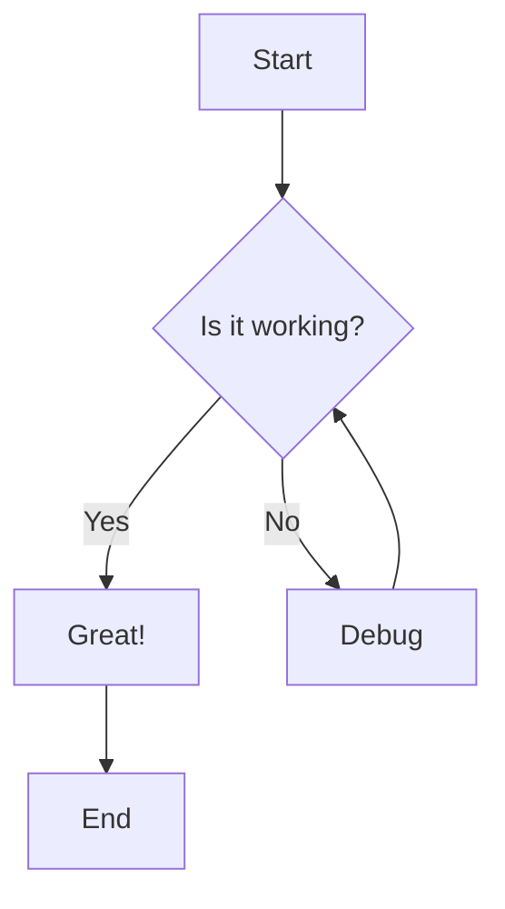
````


### Flowchart LR (left to right)

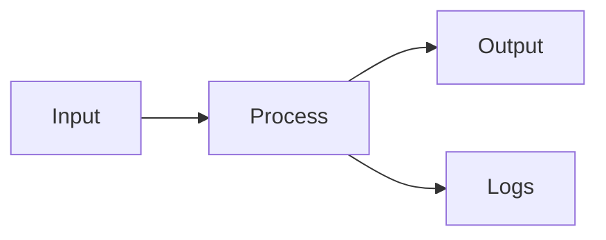

### Sequence diagram

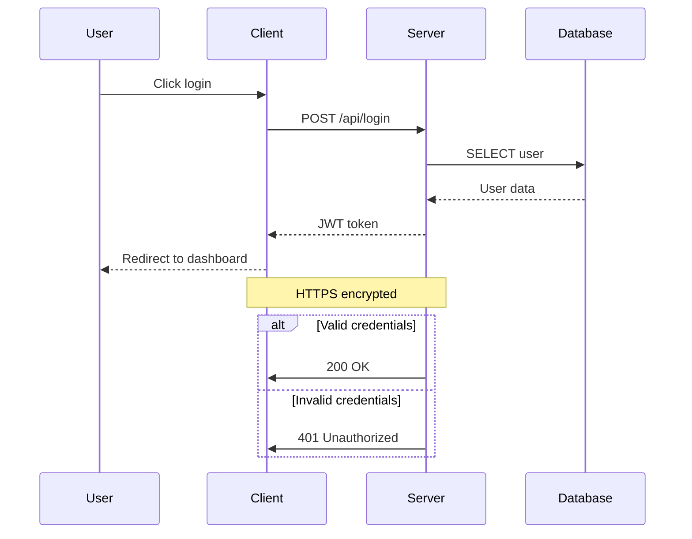

### Class diagram

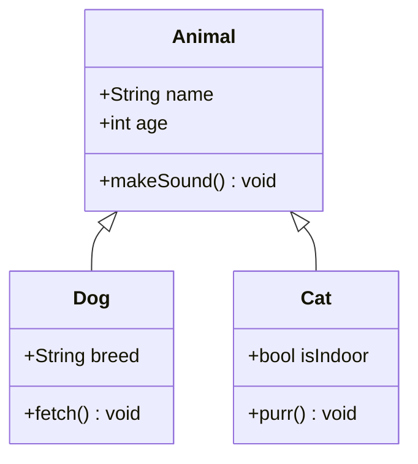

### State diagram

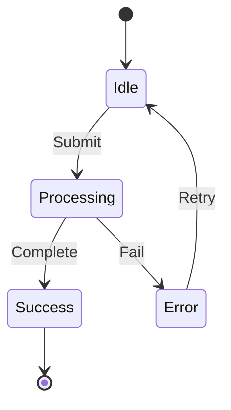

### Entity Relationship diagram

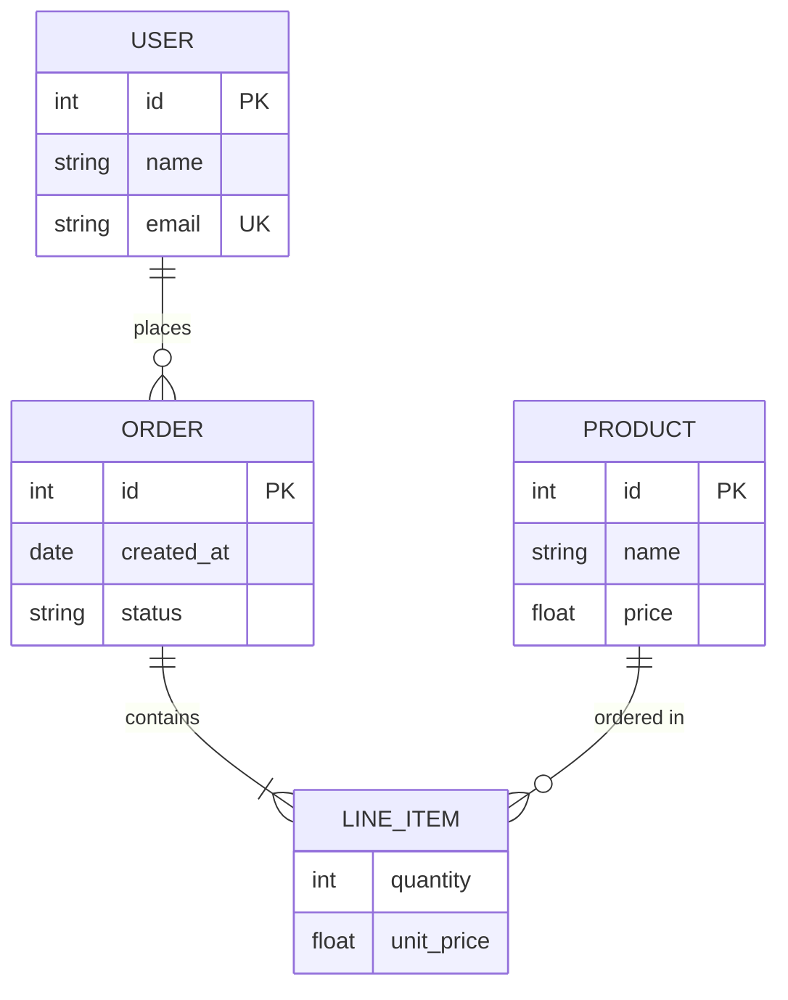

### Gantt chart

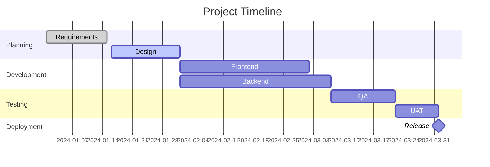

### Pie chart

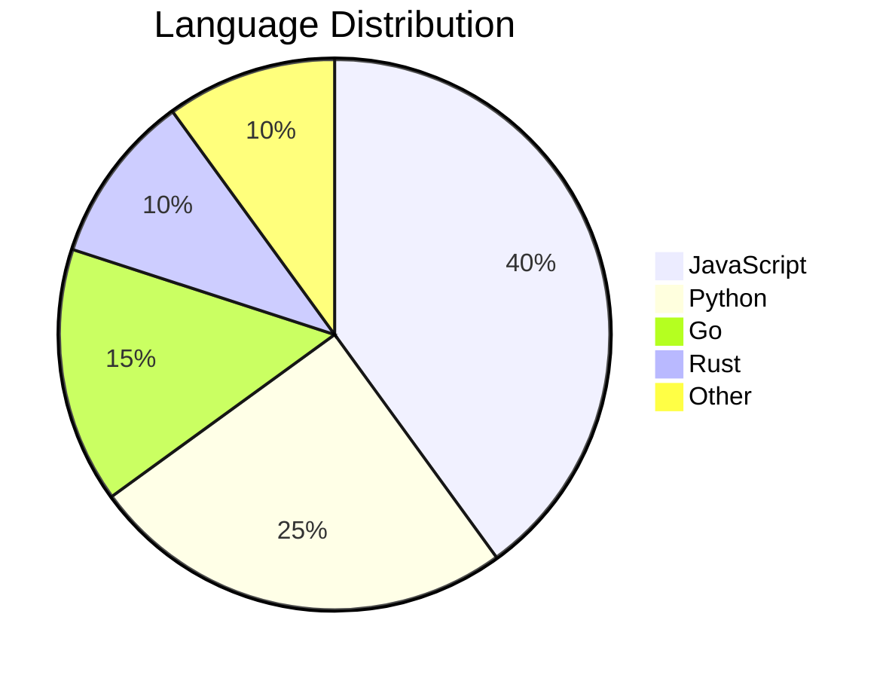

### Git graph

```mermaid
gitgraph
    commit
    commit
    branch develop
    checkout develop
    commit
    commit
    branch feature
    checkout feature
    commit
    commit
    checkout develop
    merge feature
    checkout main
    merge develop
    commit
```

### Journey diagram

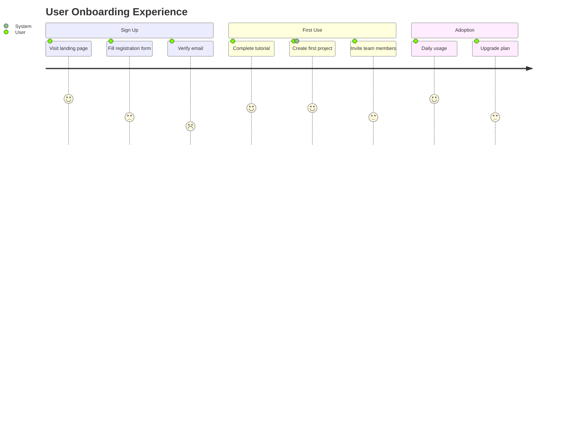

### Mindmap

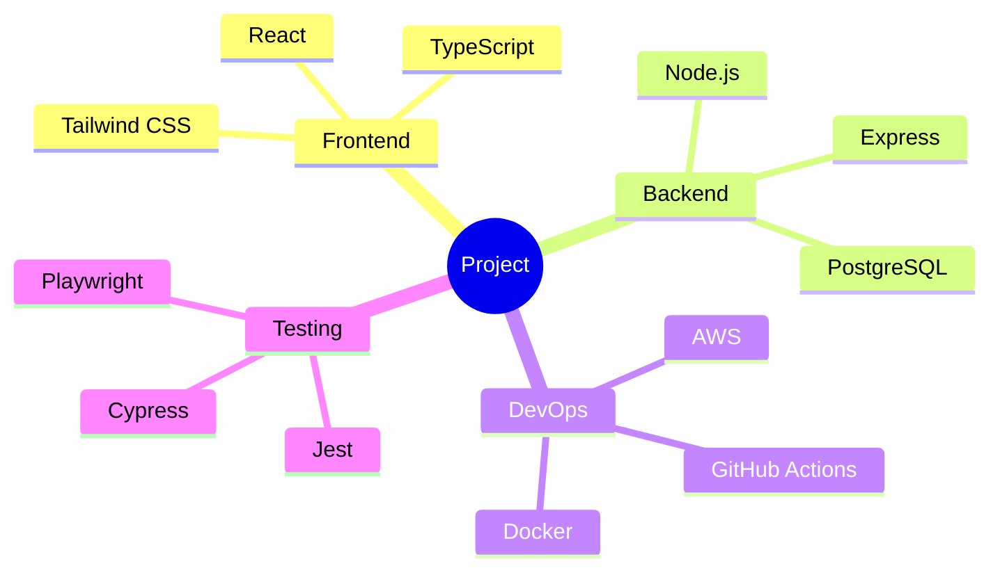

### Timeline

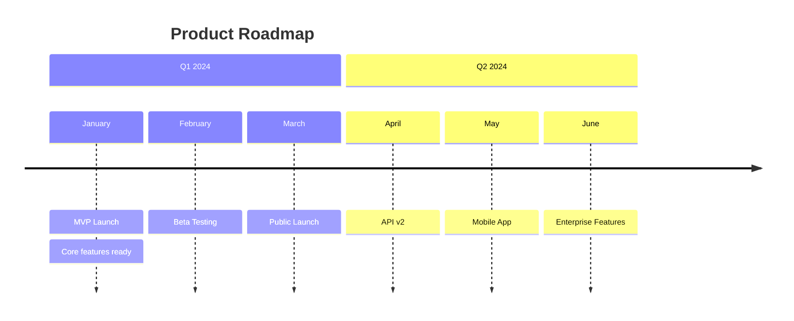

### Quadrant chart

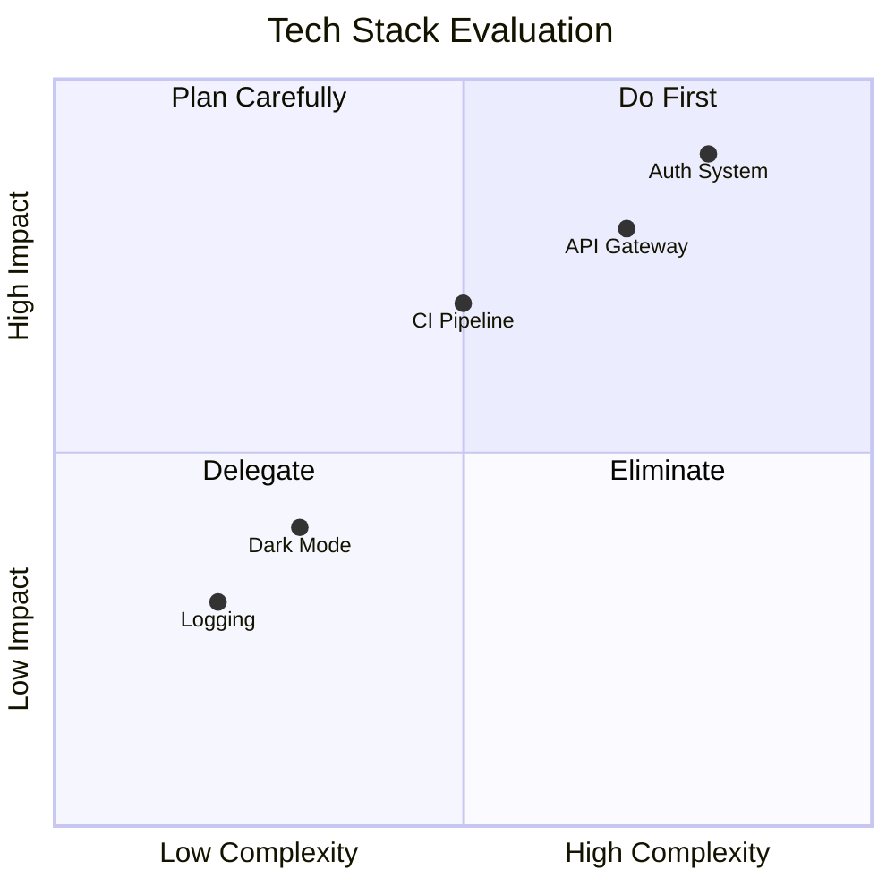

---

## GeoJSON / TopoJSON Maps

GitHub renders GeoJSON and TopoJSON maps in fenced code blocks.

````markdown
```geojson
{
  "type": "FeatureCollection",
  "features": [
    {
      "type": "Feature",
      "properties": {
        "name": "GitHub HQ"
      },
      "geometry": {
        "type": "Point",
        "coordinates": [-122.3321, 37.5481]
      }
    },
    {
      "type": "Feature",
      "properties": {
        "name": "Area around GitHub HQ"
      },
      "geometry": {
        "type": "Polygon",
        "coordinates": [
          [
            [-122.3400, 37.5550],
            [-122.3250, 37.5550],
            [-122.3250, 37.5400],
            [-122.3400, 37.5400],
            [-122.3400, 37.5550]
          ]
        ]
      }
    }
  ]
}
```
````

```geojson
{
  "type": "FeatureCollection",
  "features": [
    {
      "type": "Feature",
      "properties": {
        "name": "GitHub HQ"
      },
      "geometry": {
        "type": "Point",
        "coordinates": [-122.3321, 37.5481]
      }
    },
    {
      "type": "Feature",
      "properties": {
        "name": "Area around GitHub HQ"
      },
      "geometry": {
        "type": "Polygon",
        "coordinates": [
          [
            [-122.3400, 37.5550],
            [-122.3250, 37.5550],
            [-122.3250, 37.5400],
            [-122.3400, 37.5400],
            [-122.3400, 37.5550]
          ]
        ]
      }
    }
  ]
}
```

### TopoJSON

````markdown
```topojson
{
  "type": "Topology",
  "objects": {
    "example": {
      "type": "GeometryCollection",
      "geometries": [
        {
          "type": "Point",
          "coordinates": [0, 0],
          "properties": {"name": "Origin"}
        }
      ]
    }
  }
}
```
````

```topojson
{
  "type": "Topology",
  "objects": {
    "example": {
      "type": "GeometryCollection",
      "geometries": [
        {
          "type": "Point",
          "coordinates": [0, 0],
          "properties": {"name": "Origin"}
        }
      ]
    }
  }
}
```

---

## STL 3D Models

GitHub can render STL files. You can reference them from your repo:

```markdown
[View 3D model](model.stl)
```

Or embed with a fenced block (for `.stl` files in the repo):

````markdown
```stl
solid cube
  facet normal 0 0 -1
    outer loop
      vertex 0 0 0
      vertex 1 0 0
      vertex 1 1 0
    endloop
  endfacet
  facet normal 0 0 -1
    outer loop
      vertex 0 0 0
      vertex 1 1 0
      vertex 0 1 0
    endloop
  endfacet
endsolid cube
```
````

```stl
solid cube
  facet normal 0 0 -1
    outer loop
      vertex 0 0 0
      vertex 1 0 0
      vertex 1 1 0
    endloop
  endfacet
  facet normal 0 0 -1
    outer loop
      vertex 0 0 0
      vertex 1 1 0
      vertex 0 1 0
    endloop
  endfacet
endsolid cube
```

---

## References & Autolinks

### URL autolinks

```markdown
Visit https://github.com for more information.
```

Visit https://github.com for more information.

### SHA references

```markdown
Full SHA: a]5c3785ed8d6a35868bc169f07e40e889087fd2
Short SHA: a5c3785
```

When used in a repo context, these auto-link to commits.

### Issue and PR references

```markdown
#1
GH-1
username/repo#1
organization/repo#1
```

### Cross-repository references

```markdown
github/docs#1
github/linguist#100
```

---

## Mentions & Team Mentions

```markdown
@username — mentions a specific user
@organization/team-name — mentions an entire team
```

---

## SHA, Issue & PR References

In issues, PRs, and comments:

```markdown
Fixes #42
Closes #42
Resolves #42

Related to #10, #20, and #30

See commit abc1234
See abc1234...def5678 for the full diff

Compare: main...feature-branch
```

---

## Keyboard Keys

```markdown
<kbd>Ctrl</kbd> + <kbd>C</kbd>
<kbd>Cmd</kbd> + <kbd>V</kbd>
<kbd>Shift</kbd> + <kbd>Alt</kbd> + <kbd>F</kbd>
<kbd>Enter</kbd>
<kbd>Esc</kbd>
<kbd>Tab</kbd>
<kbd>Space</kbd>
<kbd>Backspace</kbd>
<kbd>Delete</kbd>
<kbd>Home</kbd>
<kbd>End</kbd>
<kbd>Page Up</kbd>
<kbd>Page Down</kbd>
<kbd>F1</kbd> through <kbd>F12</kbd>
<kbd>&uarr;</kbd> <kbd>&darr;</kbd> <kbd>&larr;</kbd> <kbd>&rarr;</kbd>
```

<kbd>Ctrl</kbd> + <kbd>C</kbd>
<kbd>Cmd</kbd> + <kbd>V</kbd>
<kbd>Shift</kbd> + <kbd>Alt</kbd> + <kbd>F</kbd>
<kbd>Enter</kbd>
<kbd>Esc</kbd>
<kbd>Tab</kbd>
<kbd>Space</kbd>
<kbd>Backspace</kbd>
<kbd>Delete</kbd>
<kbd>Home</kbd>
<kbd>End</kbd>
<kbd>Page Up</kbd>
<kbd>Page Down</kbd>
<kbd>F1</kbd> through <kbd>F12</kbd>
<kbd>&uarr;</kbd> <kbd>&darr;</kbd> <kbd>&larr;</kbd> <kbd>&rarr;</kbd>

---

## Superscript & Subscript

```markdown
Superscript: X<sup>2</sup>, e<sup>i&pi;</sup>, 10<sup>3</sup>
Subscript: H<sub>2</sub>O, CO<sub>2</sub>, log<sub>2</sub>(n)

Nested: X<sup>2<sup>n</sup></sup>
Combined: a<sub>1</sub><sup>2</sup>
```

Superscript: X<sup>2</sup>, e<sup>i&pi;</sup>, 10<sup>3</sup>
Subscript: H<sub>2</sub>O, CO<sub>2</sub>, log<sub>2</sub>(n)

Nested: X<sup>2<sup>n</sup></sup>
Combined: a<sub>1</sub><sup>2</sup>

---

## Highlighting / Marking Text

```html
<mark>This text is highlighted</mark>
<mark style="background-color: yellow;">Yellow highlight</mark>
```

<mark>This text is highlighted</mark>

---

## Anchor Links

Every heading automatically gets an anchor. The rules:

1. Convert to lowercase
2. Remove punctuation (except hyphens)
3. Replace spaces with hyphens
4. Collapse consecutive hyphens

```markdown
[Link to this section](#anchor-links)
[Link to Headings section](#headings)
[Link to Task Lists](#task-lists--checkboxes)
```

[Link to this section](#anchor-links)
[Link to Headings section](#headings)
[Link to Task Lists](#task-lists--checkboxes)

### Manual anchor

```html
<a id="custom-anchor"></a>

[Jump to custom anchor](#custom-anchor)
```

<a id="custom-anchor"></a>

[Jump to custom anchor](#custom-anchor)

---

## Relative Links & Repository Links

```markdown
[README](README.md)
[Source code](src/index.js)
[Documentation](docs/)
[Parent directory file](../other-file.md)
[License](./LICENSE)

[Go to line 42 in a file](src/index.js#L42)
[Go to lines 10-20 in a file](src/index.js#L10-L20)
```

---

## Badges & Shields

Badges are just images that link to something. Use [shields.io](https://shields.io):

```markdown


```

### Badge styles

```markdown


```


### Custom color badges

```markdown


```


### Clickable badges

```markdown
[](https://choosealicense.com/licenses/mit/)
[](http://makeapullrequest.com)
```

[](https://choosealicense.com/licenses/mit/)
[](http://makeapullrequest.com)

---

## Table of Contents (Auto-generated)

GitHub automatically generates a table of contents accessible via the "hamburger" icon at the top-left of any README or Markdown file. You can also create a manual TOC using anchor links as shown at the [top of this document](#the-complete-github-markdown-reference).

---

## Comments (Hidden Text)

These won't render at all — useful for notes to collaborators.

```markdown
<!-- This is a comment. It won't show in the rendered Markdown. -->

[//]: # (This is also a comment using the reference-link hack)

[//]: # "Another comment style"

[//]: # 'And yet another'

[comment]: <> (One more comment style)
```

<!-- This is a comment. It won't show in the rendered Markdown. -->

[//]: # (This is also a comment using the reference-link hack)

[//]: # "Another comment style"

[//]: # 'And yet another'

[comment]: <> (One more comment style)

---

## Videos

GitHub supports video uploads directly in issues, PRs, and discussions. In Markdown files you can:

### Link to a video

```markdown
[Watch the video](https://www.youtube.com/watch?v=dQw4w9WgXcQ)
```

### Video thumbnail with link

```markdown
[](https://www.youtube.com/watch?v=dQw4w9WgXcQ)
```

[](https://www.youtube.com/watch?v=dQw4w9WgXcQ)

### HTML5 video (for uploaded videos in repo)

```html
<video src="https://user-images.githubusercontent.com/video.mp4" controls width="600"></video>
```

### Linking to uploaded assets

```markdown
https://github.com/user/repo/assets/12345678/abcdefgh-1234-5678-abcd-1234567890ab
```

When you drag-and-drop a video into a comment, GitHub auto-generates this.

---

## Color Chips / Color Preview

GitHub renders color codes as colored chips in code spans:

```markdown
`#ff0000` `#00ff00` `#0000ff`
`#ffffff` `#000000` `#808080`
`rgb(255, 0, 0)` `rgb(0, 128, 255)`
`hsl(120, 100%, 50%)` `hsl(240, 100%, 50%)`
`#f00` `#0f0` `#00f`
`#ff634780` (with alpha)
```

`#ff0000` `#00ff00` `#0000ff`
`#ffffff` `#000000` `#808080`
`rgb(255, 0, 0)` `rgb(0, 128, 255)`
`hsl(120, 100%, 50%)` `hsl(240, 100%, 50%)`
`#f00` `#0f0` `#00f`
`#ff634780`

---

## Diff / Colored Diff Blocks

````markdown
```diff
- This line was removed
+ This line was added
  This line is unchanged
! This line is notable
# This is a comment in a diff
@@ -1,4 +1,4 @@
 context line
-old line
+new line
 context line
```
````

```diff
- This line was removed
+ This line was added
  This line is unchanged
! This line is notable
# This is a comment in a diff
@@ -1,4 +1,4 @@
 context line
-old line
+new line
 context line
```

---

## YAML Front Matter

GitHub recognizes YAML front matter at the very beginning of Markdown files and renders it as a table:

```markdown
---
title: My Document
author: John Doe
date: 2024-01-01
tags: [markdown, github, reference]
---
```

This renders as a metadata table at the top of the file on GitHub.

---

## Drag-and-Drop Attachments

In GitHub issues, PRs, and discussions (not in README files viewed on GitHub), you can:

- **Drag and drop** images directly into the comment box
- **Paste** images from clipboard with <kbd>Ctrl</kbd>/<kbd>Cmd</kbd> + <kbd>V</kbd>
- Supported formats: PNG, GIF, JPG, JPEG, SVG, BMP, ICO, MP4, MOV, WEBM, LOG, DOCX, PPTX, XLSX, TXT, PDF, ZIP

The generated syntax looks like:

```markdown

```

---

## GitHub-Specific Syntax Summary

A quick-reference of GitHub-only extensions beyond standard Markdown:

| Feature | Syntax | Where it works |
| --- | --- | --- |
| Task lists | `- [x] done` / `- [ ] todo` | Everywhere |
| Alerts | `> [!NOTE]` | Everywhere |
| Emoji shortcodes | `:emoji_name:` | Everywhere |
| Footnotes | `[^1]` | Everywhere |
| Mermaid diagrams | ` ```mermaid ` | Everywhere |
| Math (LaTeX) | `$inline$` / `$$block$$` | Everywhere |
| GeoJSON maps | ` ```geojson ` | Everywhere |
| TopoJSON maps | ` ```topojson ` | Everywhere |
| STL 3D models | ` ```stl ` | Everywhere |
| Color chips | `` `#hex` `` in backticks | Issues, PRs, Discussions |
| @mentions | `@username` | Issues, PRs, Discussions |
| Issue refs | `#123` | Issues, PRs, Discussions |
| Commit refs | `SHA` | Issues, PRs, Discussions |
| Cross-repo refs | `owner/repo#123` | Issues, PRs, Discussions |
| Auto-close keywords | `Fixes #123` | PR descriptions, commits |
| YAML front matter | `---` block at top | Markdown files |
| `<details>` toggle | HTML tag | Everywhere |
| `<picture>` theming | HTML tag | Everywhere |
| Video embeds | Drag-and-drop upload | Issues, PRs, Discussions |
| Diff highlighting | ` ```diff ` | Everywhere |
| Keyboard keys | `<kbd>` tag | Everywhere |

---

## Full Formatting Cheat Sheet

| You type | You get |
| --- | --- |
| `**bold**` | **bold** |
| `*italic*` | *italic* |
| `***bold italic***` | ***bold italic*** |
| `~~strikethrough~~` | ~~strikethrough~~ |
| `` `inline code` `` | `inline code` |
| `[link](url)` | [link](https://github.com) |
| `` | image |
| `> quote` | blockquote |
| `- item` | unordered list |
| `1. item` | ordered list |
| `- [x] task` | checked task |
| `- [ ] task` | unchecked task |
| `---` | horizontal rule |
| `# H1` through `###### H6` | headings |
| ` ``` ` ... ` ``` ` | code block |
| `\|col\|col\|` | table |
| `$math$` | inline math |
| `$$math$$` | block math |
| `:emoji:` | emoji |
| `[^1]` | footnote |
| `> [!NOTE]` | alert/callout |
| `<kbd>key</kbd>` | keyboard key |
| `<sup>x</sup>` | superscript |
| `<sub>x</sub>` | subscript |
| `<mark>text</mark>` | highlight |
| `<details>` | collapsible |
| `<!-- -->` | hidden comment |

---

<div align="center">

**Made with :heart: for the Markdown community**

*Copy, paste, and adapt anything from this reference freely.*

[Back to Top](#the-complete-github-markdown-reference)

</div>
